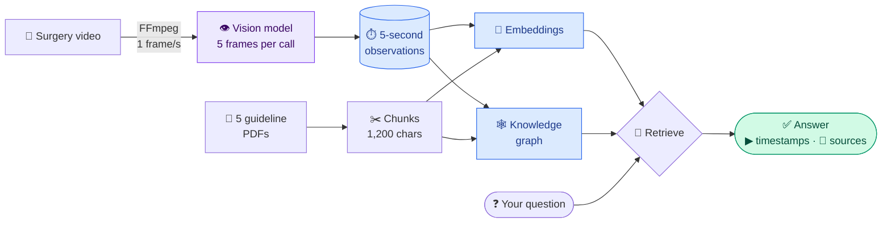
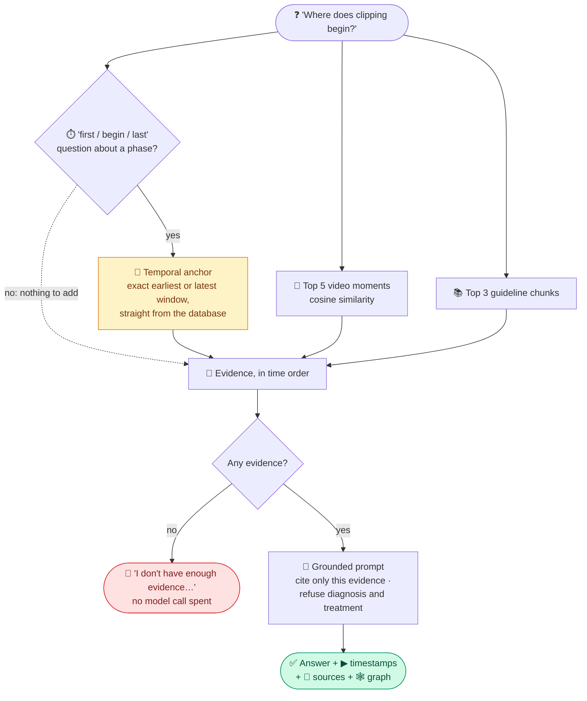
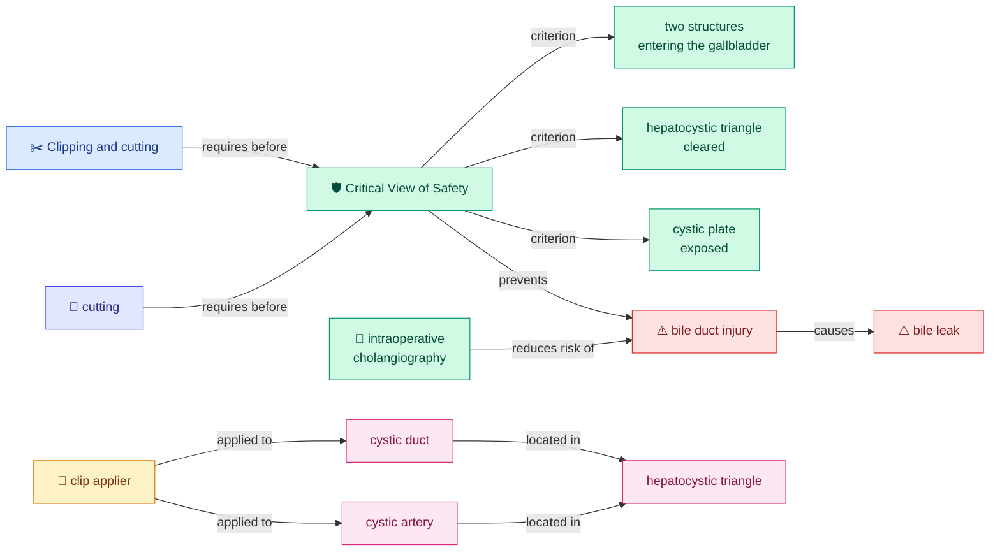
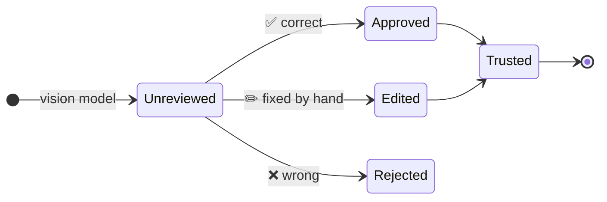

<div align="center">

# 🔬 Surgical Video Knowledge

### Ask a surgery video a question. Get the exact moment, the guideline that backs it, and how the concepts connect.

<p>
  
  
  
  
  
  
  
  
</p>

**[✨ What it does](#-what-it-does)** · **[🧠 How it works](#-how-it-works)** · **[🕸 Knowledge graph](#-the-knowledge-graph)** · **[🧪 Evaluation](#-evaluation)** · **[🚀 Quickstart](#-quickstart)**

</div>

<br>

| 🎥 **Watches** | 📚 **Reads** | 🕸 **Connects** | 🛡 **Refuses** |
|:---:|:---:|:---:|:---:|
| labels the surgery second by second: phase, instruments, actions | 5 open-access surgical guidelines, cited by name | links video moments and guideline facts in one graph | diagnosis, treatment and patient-management questions |

> [!IMPORTANT]
> **Educational and review tool only.** Not for diagnosis, treatment decisions or surgical assistance.
> Built on a laparoscopic cholecystectomy (gallbladder removal) case, but the design works for any *video + documents* domain.

---

## ✨ What it does

Ask *"Where does clipping begin?"* and you get:

```text
Clipping begins at 4:00–4:04, where clips are applied to the cystic duct.
   ▶ 4:00–4:04        click → the video jumps there and plays
   📄 Source: safe-cholecystectomy guideline (Critical View of Safety)
   🕸 Clipping and cutting ─requires─▶ Critical View of Safety ─prevents─▶ bile duct injury
```

Three things most systems keep apart, in one answer:

| | Capability | What it means |
|---|---|---|
| 🎥 | **Video understanding** | a vision model labels every second: surgical phase, instruments, actions, with timestamps |
| 📚 | **Medical knowledge** | answers come from real guidelines, and **every source is cited** |
| 🕸 | **Knowledge graph** | concepts link across the video *and* the documents, so multi-hop questions work |

---

## 🎬 The experience

A clean web app: **video on the left, chat on the right**.

- 💬 **Ask → get a clickable timestamp → the video jumps to that moment and plays.**
- ⏯️ **Scrub the video** and a live **"Now showing"** panel describes that second: phase, instruments, observation.
- 🌈 A **colored phase timeline** under the player jumps to any surgical phase.
- 🧾 Answers come with **evidence cards** (video moments + cited guideline pages) and a **knowledge-graph view** of the concepts involved.
- 🩺 The Streamlit version adds the **physician review** workflow (approve, edit or reject each observation).

---

## 🧠 How it works



<sub>Everything left of 🔎 is built once by `scripts/build_all.py`; only the retrieval and answer run per question.</sub>

1. **🎥 Ingest the video.** FFmpeg samples 1 frame per second, and a vision model reads 5 frames at a time into a
   structured, timestamped observation (phase, instruments, actions, confidence). Every observation is validated
   with Pydantic and saved straight away, so a re-run skips windows that are already done.
2. **📚 Ingest the documents.** Five open-access guideline PDFs are split into overlapping chunks.
3. **🔢 Index and graph.** Observations and chunks are embedded for cosine search, and a knowledge graph links
   concepts across both.
4. **✅ Answer.** The question pulls the best video and document evidence, and the model writes an answer that
   cites it. Nothing is stated that the evidence does not support.

### 🎯 What happens to one question



> 📌 **Why the temporal anchor?** Semantic search finds the *most similar* moment, not the *first* one.
> For "when does X begin?" the anchor does an exact earliest-window lookup for that phase, so the answer is
> right every time instead of most of the time.

---

## 🕸 The knowledge graph

The graph is **ontology-constrained**: 6 node types, 9 allowed relations, and type rules that throw away
implausible edges (an anatomy node "causing" something, or a complication "reducing risk").
On top of the edges extracted from the guidelines sits a **backbone of well-established facts**, so the key
multi-hop chains are always there:



<sub>🟦 phase · 🟪 action · 🟩 safety step · 🟥 complication · 🟨 instrument · 🩷 anatomy</sub>

| Node types | Relations |
|---|---|
| anatomy · instrument · phase · action · safety step · complication | `requires_before` · `applied_to` · `causes` · `prevents` · `part_of` · `occurs_in_phase` · `uses_instrument` · `located_in` · `reduces_risk_of` |

Synonyms are mapped to one canonical node (`CBD` → *common bile duct*, `Calot's triangle` → *hepatocystic triangle*),
and extracted edges are cached by content hash, so re-runs are free.

---

## 🩺 Physician review

AI observations are a draft. A clinician turns them into trusted knowledge:



Switch on **"reviewed only"** and video answers use approved and edited observations only, so nothing unreviewed or rejected reaches the answer.

---

## 🧪 Evaluation

The repo ships a **100-question test set** ([`TEST_QUESTIONS.md`](TEST_QUESTIONS.md)) across 7 groups: video events,
phases, instruments, guidelines, multi-hop, safety refusals and graph questions. An automated tester asked the
first 50 (the objective video questions), and a separate verifier scored each answer out of 100 against the ground truth.

```text
Video events   (Q1–20)   ███████████████▍     76.8
Instruments    (Q36–50)  ███████████          55.3
Phases         (Q21–35)  █████████▊           49.3
─────────────────────────────────────────────────
Overall        (Q1–50)   ████████████▍        62.1 / 100     18 perfect · 17 below 40
```

| ✅ Nailed it | 🔧 Known gaps (with fixes planned) |
|---|---|
| "begin / first" questions via the temporal anchor (6 of 6 at 100) | "what happens at 13:20?" needs a direct time lookup |
| the last phase, packaging and retraction times | aggregate questions ("which phase is longest?") need timeline stats |
| instrument identity | "first used" for instruments: the anchor covers phases only |
| refusing an out-of-range timestamp | one fabricated start time, tied to the same timeline gap |

Honest numbers over rosy ones. The full per-question breakdown is in [`TEST_QUESTIONS.md`](TEST_QUESTIONS.md).

---

## 🛠 Tech stack

| Layer | Choice |
|---|---|
| Vision and answers | **OpenAI `gpt-4o-mini`** (override with `VISION_MODEL`, `ANSWER_MODEL`) |
| Embeddings | **`text-embedding-3-small`** (`EMBED_MODEL`) |
| Video | **FFmpeg**, bundled through `imageio-ffmpeg`: nothing to install system-wide |
| Storage and search | **SQLite** · **NumPy** cosine similarity |
| Knowledge graph | **NetworkX** |
| Data contracts | **Pydantic** |
| Apps | **FastAPI** + hand-built HTML/CSS/JS (no build step) · **Streamlit** (with physician review) |

---

## 🚀 Quickstart

> Needs **Python 3.9+** and your own **OpenAI API key**. Processing one ~18-minute video costs about **$0.50–1**.

```bash
# 1. Clone
git clone https://github.com/karthi-ai-engineer/Surgical-Video-Knowledge.git
cd Surgical-Video-Knowledge

# 2. Install into a local venv (FFmpeg comes with it)
python3 -m venv .venv
./.venv/bin/pip install -r requirements.txt

# 3. Add your OpenAI key
cp .env.example .env          # then set OPENAI_API_KEY in .env

# 4. Add a laparoscopic cholecystectomy video as data/surgery.mp4
#    (the guideline PDFs download automatically in the next step)

# 5. Build everything with one command: papers, database, video, documents, index, graph
./.venv/bin/python scripts/build_all.py     # resumable and cached, about 10–15 min

# 6. Launch the web app
./.venv/bin/python server.py                # → http://127.0.0.1:8000
```

Prefer Streamlit, with the approve / edit / reject review workflow?

```bash
./.venv/bin/streamlit run app.py
```

<details>
<summary><b>🪟 On Windows</b></summary>

<br>

```powershell
python -m venv .venv
.\.venv\Scripts\pip install -r requirements.txt
Copy-Item .env.example .env
.\.venv\Scripts\python scripts\build_all.py
.\.venv\Scripts\python server.py
```

</details>

---

## 📚 The guidelines it reads

All open access, fetched from Europe PMC by `scripts/download_papers.py`:

| | Guideline |
|---|---|
| 🛡️ | Critical View of Safety in laparoscopic cholecystectomy |
| ⚠️ | WSES 2020 guideline on bile duct injury |
| 🩻 | Bile duct injury prevention and intraoperative cholangiography |
| 🔥 | WSES 2020 guideline on acute calculous cholecystitis |
| 📋 | Tokyo Guidelines: diagnostic criteria for cholecystitis |

---

## 🧩 Project structure

```text
Surgical-Video-Knowledge/
├── server.py            # FastAPI backend for the web app
├── app.py               # Streamlit app (with physician review)
├── config.py            # models, paths, sampling settings (budget-first defaults)
├── web/                 # frontend: index.html, style.css, app.js
├── pipeline/
│   ├── video.py         # FFmpeg frame extraction
│   ├── analyze.py       # vision model → structured observations
│   ├── documents.py     # PDF → chunks
│   ├── index.py         # embeddings and indexes
│   ├── retrieve.py      # semantic search over video and documents
│   ├── answer.py        # grounded answers + temporal anchor
│   ├── graph.py         # ontology-constrained knowledge graph
│   └── db.py            # SQLite storage + review workflow
├── models/schemas.py    # Pydantic data contracts
├── scripts/             # build_all, ingest_video, ingest_documents, build_index, build_graph, download_papers, run_test
├── data/                # your video + generated artifacts (git-ignored)
├── PROJECT_PLAN.md      # design decisions, phase by phase
└── TEST_QUESTIONS.md    # 100-question test set + evaluation results
```

---

## 💰 Cost

Budget-first by design: mini models, every API call cached, and ingestion that resumes where it stopped.
One ~18-minute video costs about **$0.50–1** end to end. Each question afterwards costs a fraction of a cent.

---

## ⚠️ Safety and scope

- 🎓 An **educational, review and information-retrieval** tool. **Not** diagnostic AI, **not** treatment guidance,
  and **not** autonomous surgical assistance.
- 👀 AI video observations are approximate and **need expert validation**. The app says so.
- 🙅 It is built to **refuse** diagnosis, treatment, surgeon-intent and patient-management questions, and to **never
  invent** timestamps or facts.

---

## 📦 What's in the repo (and what isn't)

**Included:** all source code, config, docs, the test set, and the paper download script.<br>
**Not included, by design:** your `.env`, the surgery video (bring your own `data/surgery.mp4`), the guideline PDFs
(fetched by the script), the virtualenv, and all generated files. Everything regenerates with `scripts/build_all.py`.

## 📄 License and data

Guideline PDFs come from open-access sources (Europe PMC) for research and education. Bring your own surgical
video and respect its license; do not redistribute copyrighted material. The code is provided as-is for educational
and demonstration purposes.
