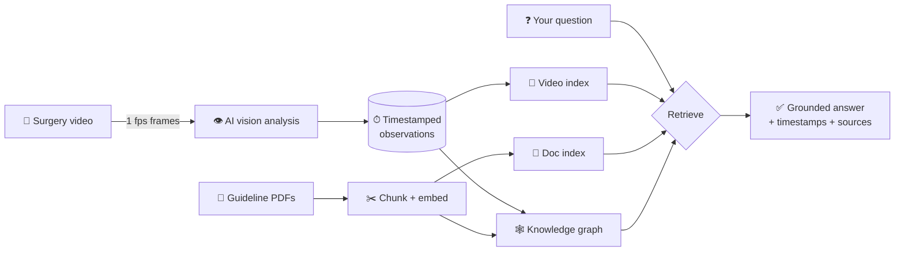

# 🔬 Surgical Video Knowledge

> An AI-powered **"ask-the-surgery"** system. It *watches* a surgical video, *reads* trusted medical
> guidelines, and answers your questions with **clickable timestamps** that jump the video to the exact
> moment — every answer grounded in visible evidence and cited sources.

**Educational / review tool — not for diagnosis or treatment decisions.**
Built on a laparoscopic cholecystectomy case, but the architecture works for any *video + documents* domain.

---

## ✨ What it does

Ask a question like *"Where does clipping begin?"* and you get:

```
Clipping begins at 4:00–4:04, where clips are applied to the cystic duct.
   ▶ 4:00–4:04  (click → the video jumps there and plays)
   📄 Source: safe-cholecystectomy guideline (Critical View of Safety)
```

It combines three things most systems keep separate:

| Capability | What it means |
|---|---|
| 🎥 **Video understanding** | AI labels the surgery second-by-second (phase, instruments, actions) with timestamps |
| 📚 **Medical knowledge** | Retrieves answers from real, trusted surgical guidelines and **cites the source** |
| 🕸 **Knowledge graph** | Connects concepts across the video *and* the documents (e.g. *clipping → requires → Critical View of Safety → prevents → bile duct injury*) |

…and it **grounds every answer** (no hallucination), **refuses** diagnosis/treatment requests, and supports a
**physician review** workflow (*AI proposes → human validates → trusted knowledge*).

---

## 🎬 The experience

A clean web app with the **video on the left** and a **chat on the right**:

- **Ask → get a clickable timestamp → the video jumps to that moment and plays.**
- **Scrub the video** and a live **"Now showing"** panel describes what's happening at that second (phase, instruments, observation).
- A **colored phase timeline** under the video lets you jump to any surgical phase.
- Answers show **evidence cards** (video moments + cited guideline documents) and a **knowledge-graph** view of the connected concepts.

---

## 🧠 How it works



1. **Ingest video** → FFmpeg samples 1 frame/sec → an AI vision model produces structured, timestamped
   observations (surgical phase, instruments, actions) — validated and cached.
2. **Ingest documents** → guideline PDFs are chunked and embedded.
3. **Index & graph** → observations and chunks become searchable vectors; a knowledge graph links
   concepts across both modalities.
4. **Answer** → your question retrieves the most relevant video + document evidence, a deterministic
   *temporal anchor* pins "begin/first" questions to the exact earliest moment, and the model writes a
   **grounded, cited** answer. Nothing is asserted that the evidence doesn't support.

---

## 🗂 Tech stack

- **Python** · **OpenAI** (`gpt-4o-mini` vision + answers, `text-embedding-3-small`) · **FFmpeg** (bundled)
- **FastAPI** backend + hand-built **HTML/CSS/JS** frontend (no build step) — *and* an alternative **Streamlit** UI
- **SQLite** · **NumPy** cosine search · **NetworkX** knowledge graph
- **100% self-contained** — everything lives in this folder + a local virtualenv; nothing installed system-wide

---

## 🚀 Quickstart

> Requires **Python 3.9+** and your own **OpenAI API key** (processing a video costs ≈ **$0.50–1**).

```bash
# 1. Clone
git clone https://github.com/karthi-ai-engineer/Surgical-Video-Knowledge.git
cd Surgical-Video-Knowledge

# 2. Install into a local venv (FFmpeg is bundled — no brew/apt needed)
python3 -m venv .venv
./.venv/bin/pip install -r requirements.txt

# 3. Add your OpenAI key
cp .env.example .env          # then edit .env → OPENAI_API_KEY=sk-...

# 4. Add your video  →  save a laparoscopic cholecystectomy clip as:
#    data/surgery.mp4
#    (documents download automatically in the next step)

# 5. Build everything with ONE command (papers, DB, video, docs, index, graph)
./.venv/bin/python scripts/build_all.py     # resumable & cached (~10–15 min)

# 6. Launch the web UI
./.venv/bin/python server.py                # → http://127.0.0.1:8000
```

Prefer Streamlit (includes the approve/edit/reject review workflow)?

```bash
./.venv/bin/streamlit run app.py
```

---

## 🧩 Project structure

```
Surgical-Video-Knowledge/
├── server.py            # FastAPI backend for the web UI
├── app.py               # Streamlit UI (with physician review)
├── config.py            # models, paths, sampling params (budget-first defaults)
├── web/                 # frontend (index.html, style.css, app.js)
├── pipeline/
│   ├── video.py         # FFmpeg frame extraction
│   ├── analyze.py       # AI vision → structured observations
│   ├── documents.py     # PDF → chunks
│   ├── index.py         # embeddings + build indexes
│   ├── retrieve.py      # semantic search (video + docs)
│   ├── answer.py        # grounded answer generation (+ temporal anchor)
│   ├── graph.py         # GraphRAG knowledge graph
│   └── db.py            # SQLite storage + review workflow
├── models/schemas.py    # Pydantic data contracts
├── scripts/             # build_all, ingest_video, ingest_documents, build_index, build_graph, download_papers, run_test
├── data/                # your video + generated artifacts (git-ignored)
├── PROJECT_PLAN.md      # full design decisions, phase by phase
└── TEST_QUESTIONS.md    # 100-question test set + evaluation results
```

---

## 🧪 Evaluation

The repo ships a **100-question test set** (`TEST_QUESTIONS.md`) with ground-truth answers, and an automated
**tester + verifier** harness (`scripts/run_test.py`). On the 50 objective video questions it currently scores
**~62/100** — strong on "begin/first" and lookup questions, with known gaps on arbitrary timestamp lookup and
aggregate/analytical questions (all documented, with fixes outlined). Honest metrics over rosy ones.

---

## 💰 Cost

Budget-first by design (`gpt-4o-mini` + `text-embedding-3-small`), with every API call cached and ingestion
resumable. Processing **one** ~18-minute video end-to-end costs about **$0.50–1**. Each question afterward
costs a fraction of a cent.

---

## ⚠️ Safety & scope

- This is an **educational / review / information-retrieval** tool — **not** diagnostic AI, **not** treatment
  guidance, and **not** autonomous surgical assistance.
- AI-generated video observations are approximate and **require expert validation** (the UI says so).
- The system is designed to **refuse** diagnosis, treatment, surgeon-intent, and patient-management questions,
  and to **not fabricate** timestamps or facts.

---

## 📦 What's in the repo (and what isn't)

**Included:** all source code, config, docs, the test set, and a `download_papers.py` script.
**Not included (by design):** your `.env` (secret), the surgery video (supply your own `data/surgery.mp4`),
guideline PDFs (fetched by the script), the virtualenv, and all generated artifacts — everything regenerates
via `scripts/build_all.py`.

---

## 📄 License & data

Guideline PDFs are fetched from open-access sources (Europe PMC) for research/education. Supply your own
surgical video and respect its license — do not redistribute copyrighted material. Code is provided as-is for
educational and demonstration purposes.
